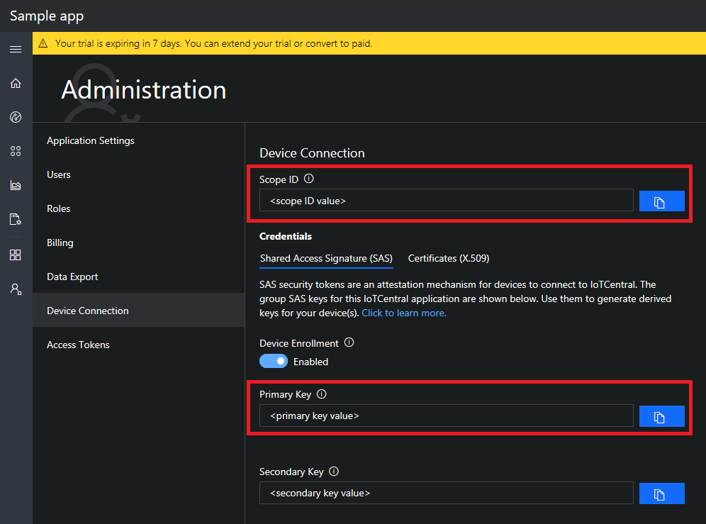
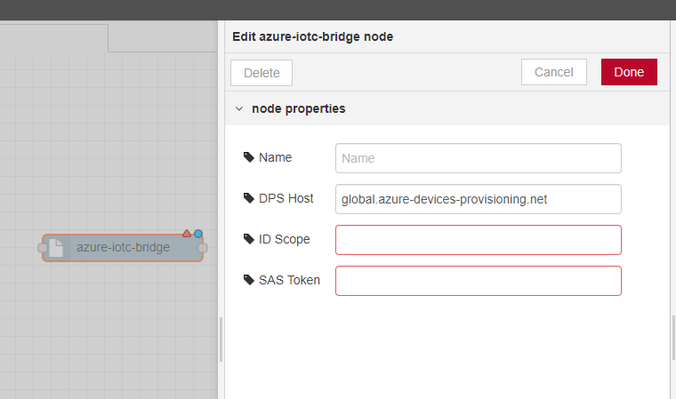
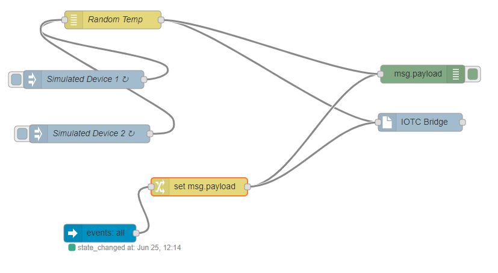
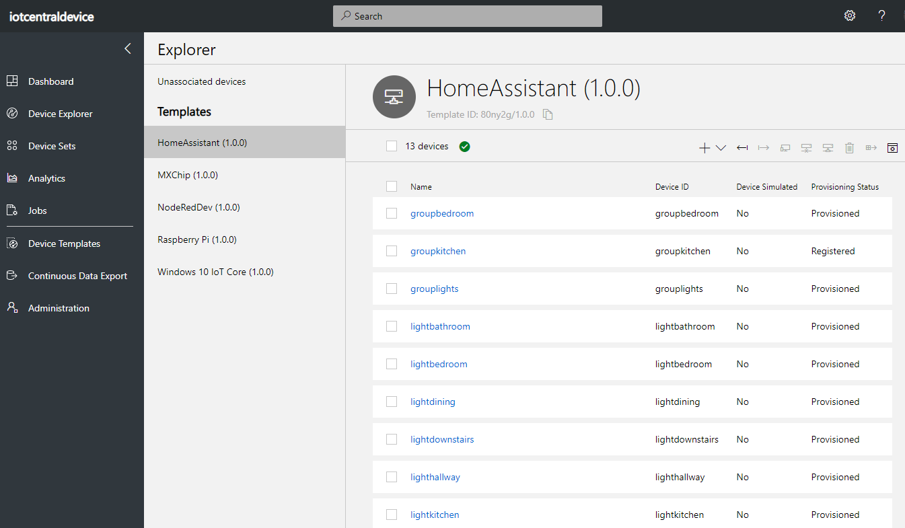

# Azure IoT Central Device Bridge module for Node-RED
This project wraps the https://github.com/Azure/iotc-device-bridge project in a Node-RED module so that any IoT device or provider can easily be connected to Azure IoT Central (IoTC) without any coding. 

When a properly formatted message arrives at the (configured) IoTC Node it will try sending it as the corresponding device in IoTC. If the device does not yet exist, it will provision a new one in IoTC. Before any telemetry will be processed you'll have to 'associate' the device with a device template in IoT Central. See the below instructions. 

## Instructions
Take the following steps to deploy the module to Node-RED and set up the device bridge.

1.  Install the node by copying this repository into a nodes folder within the user data directory of Node-RED. Resolve the dependencies of this module by running `npm install` in the newly created folder. Note that this is only recommended for development purposes, once this module is published to npm the install process will be easier.

2. Go to your IoT Central application, and navigate to the `Administration > Device Connection` area. Copy the `Scope ID` and one of the SAS keys, so either the `Primary Key` or the `Secondary Key`, and paste it into a temporary file or window for usage in the next step.

  

3. Open up Node-RED and notice that 'Azure IoTC Bridge' will show upin the nodes list on the left. Drag the node onto the canvas and double click it to configure your IoTC connection credentials from step 2.
  

4. The Node is now ready to use. External systems can feed device data through this device bridge node and into your IoT Central app by sending telemetry in the payload of messages into the input of the node. 
  

Messages sent to the device bridge node must have the following format in the payload:
```json
{
    "device": {
        "deviceId": "my-cloud-device"
    },
    "measurements": {
        "temp": 20.31,
        "pressure": 50,
        "humidity": 8.5,
        "ledColor": "blue"
    },   
    "properties":{
        "asetting": "off"
    }
}
```

An optional `timestamp` field can be included in the payload, to specify the UTC date and time of the message.
This field must be in ISO format (e.g., YYYY-MM-DDTHH:mm:ss.sssZ). If `timestamp` is not provided,
the current date and time will be used.

> NOTE: `deviceId` must be alphanumeric, lowercase, and may contain hyphens. The values of the fields in `measurements` must be numbers or strings.

5. When a message with a new `deviceId` is sent to IoT Central by the device bridge, a device will be created as an **Unassociated device**. Unassociated devices appear in your IoT Central application in `Device Explorer > Unassociated devices`. Click `Associate` and choose a device template to start receiving incoming measurements from that device in IoT Central.

> NOTE: Until the device is associated to a template, the node will return an error.



## Update 1.0.3
The two parameters "idScope" and sysToken is no more an manatory parameter. You can now send that parameter within the msg.Object as msg.idScope and msg.sasToken. So now it is possible to send daa to different IoT Central Instances.

